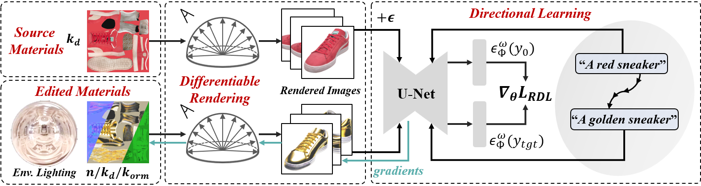

 # <p align="center"> Directional Texture Editing for 3D Models </p>

#### <p align="center"> Computer Graphics Forum (CGF), 2024 </p>

#### <p align="center">[Paper](https://onlinelibrary.wiley.com/doi/abs/10.1111/cgf.15196) | [Project Page](https://shengqiliu1.github.io/ITEM3D/) </p>


<p align="center">
  
</p>

# Introduction

This repository contains the official implementation of Directional Texture Editing for 3D Models(ITEM3D).
Our ITEM3D model presents an efficient solution to the challenging task of texture editing for 3D models.
By leveraging the knowledge from diffusion models, ITEM3D is capable to optimize the texture and environment map under the guidance of text prompts. More results can be viewed on our [Project Page](https://shengqiliu1.github.io/ITEM3D/).

# Installation

Create the environment by conda.

```
conda create -n item3d python=3.9
conda activate item3d
pip install torch==1.12.1+cu113 torchvision==0.13.1+cu113 -f https://download.pytorch.org/whl/torch_stable.html
pip install ninja imageio PyOpenGL glfw xatlas gdown
pip install git+https://github.com/NVlabs/nvdiffrast/
pip install --global-option="--no-networks" git+https://github.com/NVlabs/tiny-cuda-nn#subdirectory=bindings/torch
imageio_download_bin freeimage
pip install -r requirements.txt
```

# Demo

In this section, we present an example to edting 3D model. First, generate the mlp texture.

```
sh run/texture.sh
```

Then, edit 3D model's texuture.

```
sh run/direction_edit.sh
```

# Acknowledgement
Thanks to [NVdiffrec](https://github.com/NVlabs/nvdiffrec), [Stable-DreamFusion](https://github.com/ashawkey/stable-dreamfusion) and [Fantasia3D](https://github.com/Gorilla-Lab-SCUT/Fantasia3D), our code is partially borrowing from them.

# Citation

If you find our work useful, please consider citing:
```
@article{https://doi.org/10.1111/cgf.15196,
author = {Liu, Shengqi and Chen, Zhuo and Gao, Jingnan and Yan, Yichao and Zhu, Wenhan and Lyu, Jiangjing and Yang, Xiaokang},
title = {Directional Texture Editing for 3D Models},
journal = {Computer Graphics Forum},
volume = {n/a},
number = {n/a},
pages = {e15196},
doi = {https://doi.org/10.1111/cgf.15196},
url = {https://onlinelibrary.wiley.com/doi/abs/10.1111/cgf.15196},
eprint = {https://onlinelibrary.wiley.com/doi/pdf/10.1111/cgf.15196}
}
```
